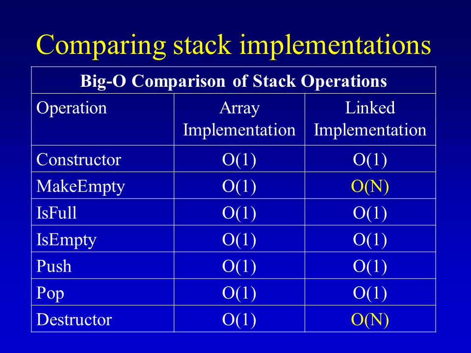
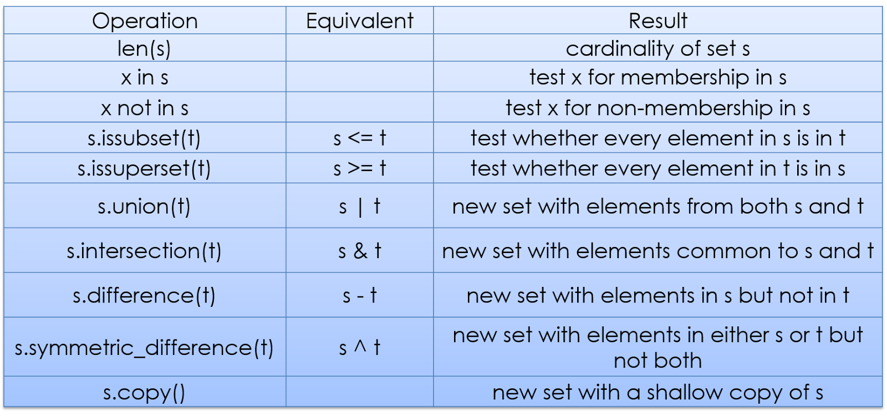
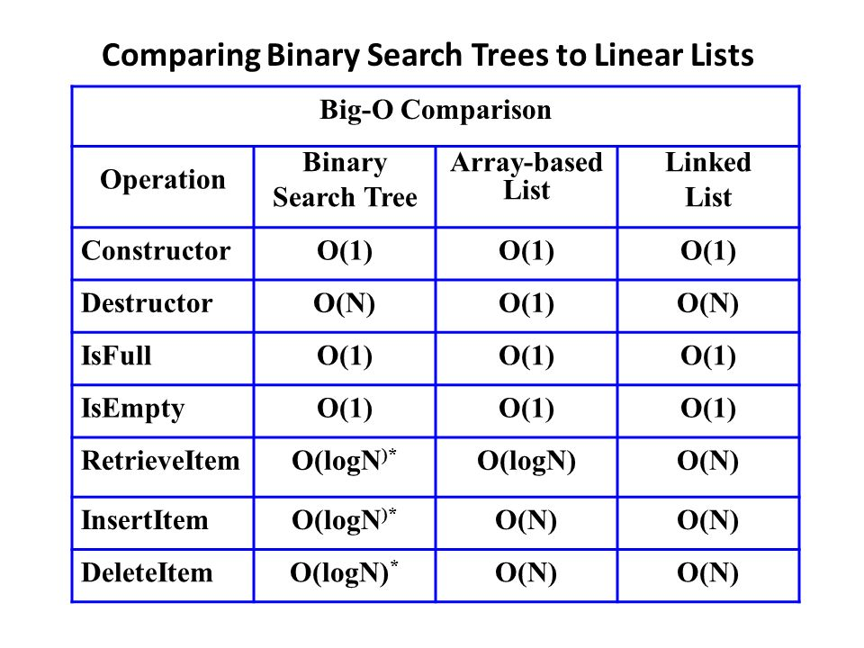

# Main Section
# Data Structure - Stacks
-Vending Machine Stack Problem

-Stacks are another data structure that are easy to learn and useful for controlling memory.

-Stacks opperate off of FIFO

>"In computing and in systems theory, FIFO an acronym for first in, first out (the first in is the first out) is a method for organizing the manipulation of a data structure (often, specifically a data buffer) where the oldest (first) entry, or "head" of the queue, is processed first."

Think of a stack of pancakes. If you want to get to the bottom pancake, you need to first remove the cakes on top.

Read more about FIFO [here](https://en.wikipedia.org/wiki/FIFO_(computing_and_electronics)#:~:text=In%20computing%20and%20in%20systems,the%20queue%2C%20is%20processed%20first.)

Big O notation, and basic stack operations:


Example Code:
```Stack implementation in python
# Creating a stack
    stack = []

# Adding things into the stack
def push(stack, thing):
    stack.append(thing)
    stack.append(1)
    print("pushed item: " + item)
#result in stack = item,1

# Removing an element from the stack. This will check to see if the stack is empty and then pop off an item if so.
def pop(stack):
    if stack == 0:
        print("stack is empty")

    return stack.pop()
```
Problem: Manage the Vending Maching

-Here is the link to the code [Link](#vendingmachinestacks.py)

Here is the solution [Link](#vendingmachinestacks-solution.py)


# Data Structure - Sets
-Sets are very similar to a list, however, they are different because of a certain unique property.
>"Because sets cannot have multiple occurrences of the same element, it makes sets highly useful to efficiently remove duplicate values from a list or tuple and to perform common math operations like unions and intersections."

Here are some basic set operations:


Read more here [Link](https://www.datacamp.com/community/tutorials/sets-in-python) 

Birth Country Statistics problem:

In this problem you will be using a set to find duplicates, delete them, and correct any upper or lower case errors.

-Here is the link to the coding problem [Link](#sets.py)

Solution: [here](#sets-solution.py)


# Data Structure - Trees
Trees are one of the most powerful data structures in programming.

>"Trees are so useful and frequently used, because they have some very serious advantages:

>Trees reflect structural relationships in the data.

>Trees are used to represent hierarchies.

>Trees provide an efficient insertion and searching.

>Trees are very flexible data, allowing to move subtrees around with minumum effort."

When we compare BSTs to other data structures an their performance, it is clear that there are some inherant advantages of tees.


Read more [here](https://java-questions.com/binary-tree-in-details.html#:~:text=Trees%20are%20so%20useful%20and,an%20efficient%20insertion%20and%20searching)

Problem: Recursion and Printing
Here is the [Link](fibbonaccisequenceproblem.py)

Solution: [here](fibbonaccisequenceproblem-solution.py)