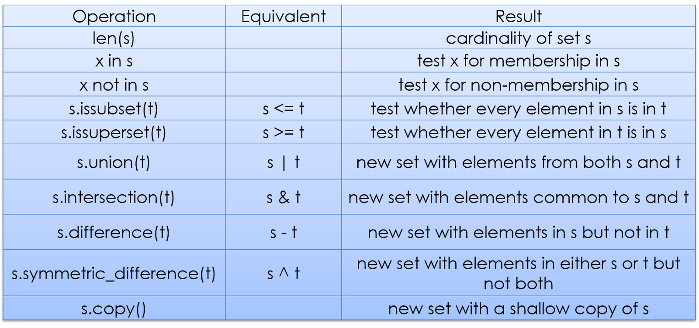

# Data Structure - Sets
-Sets are very similar to a list, however, they are different because of a certain unique property.
>"Because sets cannot have multiple occurrences of the same element, it makes sets highly useful to efficiently remove duplicate values from a list or tuple and to perform common math operations like unions and intersections."

Here are some basic set operations:

Read more here [Link](https://www.datacamp.com/community/tutorials/sets-in-python) 

Birth Country Statistics problem:

In this problem you will be using a set to find duplicates, delete them, and correct any upper or lower case errors.

-Here is the link to the coding problem [Link](#sets.py)

Solution: [here](#sets-solution.py)

Back to [main](MainSection.md)

