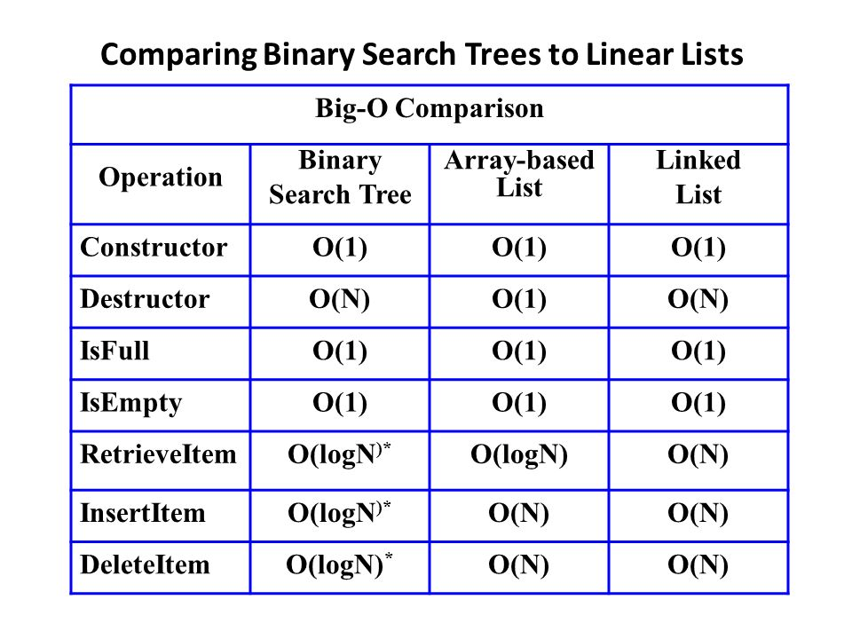

# Data Structure - Trees
Trees are one of the most powerful data structures in programming.

>"Trees are so useful and frequently used, because they have some very serious advantages:

>Trees reflect structural relationships in the data.

>Trees are used to represent hierarchies.

>Trees provide an efficient insertion and searching.

>Trees are very flexible data, allowing to move subtrees around with minumum effort."

When we compare BSTs to other data structures an their performance, it is clear that there are some inherant advantages of tees.

Read more [here](https://java-questions.com/binary-tree-in-details.html#:~:text=Trees%20are%20so%20useful%20and,an%20efficient%20insertion%20and%20searching)

Problem: Recursion and Printing
Here is the [Link](fibbonaccisequenceproblem.py)

Solution: [here](fibbonaccisequenceproblem-solution.py)

Back to [main](MainSection.md)